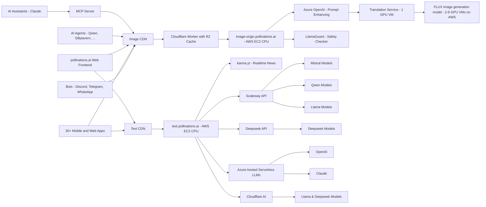

> **项目开发者注意**: 本文件是 Pollinations.AI 官方项目的README，作为我们项目依赖的第三方API的补充参考文档。请勿直接修改本文件。我们自己项目的说明请参考根目录下的 `README.md`。

<div align="center">
  
  <h1><a href="https://pollinations.ai">Pollinations.AI</a></h1>
</div>


## 🆕 Latest News

- **🔐 Auth Dashboard** - New authentication dashboard is now live! Visit [auth.pollinations.ai](https://auth.pollinations.ai) to manage your API tokens and referrer domains for priority access. [Learn more](APIDOCS.md#authentication-).
- **🏆 User Tier System** - Apps automatically upgrade through seed/flower/nectar tiers based on usage and ad integration. Higher tiers unlock unlimited usage, SOTA models, and revenue sharing. [Learn more](APIDOCS.md#user-tier-system).
- **🔍 Special Bee** - Request flower tier upgrade for unlimited usage and SOTA models! Submit a [Special Bee Request](https://github.com/pollinations/pollinations/issues/new?template=special-bee-request.yml) or use [auth.pollinations.ai](https://auth.pollinations.ai). [More info](https://github.com/pollinations/pollinations/blob/master/APIDOCS.md#special-bee-)
- **📚 API Documentation** - Major API documentation improvements! We've completely revamped our API docs with better examples, clearer explanations, and interactive code snippets. [Check it out](https://github.com/pollinations/pollinations/blob/master/APIDOCS.md).
- **🤖 MCP Server** - New Model Context Protocol (MCP) server for AI assistants like Claude to generate images directly! [Learn more](./model-context-protocol/README.md).  
  [](./model-context-protocol/README.md)
- **💲 Support Us** - You can now support us with our new **Tip Us** button. Optionally connect your Discord account to **Ko-Fi** to get premium Discord roles!
- **🎵 Audio Generation** - New text-to-speech and speech-to-text capabilities are now available! Try the `openai-audio` model - see our [API documentation](APIDOCS.md#audio-generation-api) for details.
- **🤖 AI Code Assistant** - We're excited to announce MentatBot, the autonomous AI coding assistant that implements new features directly from GitHub issues! Simply [create an issue](https://github.com/pollinations/pollinations/issues/new) describing what you'd like to see, and MentatBot will analyze and implement it. [Learn more](https://mentat.ai/).
- **🖼️ GPT Image** - Introducing our new state-of-the-art text-to-image model, GPT Image, which generates high-resolution, contextually accurate visuals from any prompt. Learn more about OpenAI's latest image generation model [here](https://openai.com/index/introducing-4o-image-generation/).
---

[](https://pollinations.ai/p/3D_wireframe_blueprint_of_the_conceptual_isometric_world_of_Pollinations_AI_a_surreal_hyperrealistic_digital_garden_Elements_emerge_partially_from_all_sides?width=3000&height=1000&seed=-1)

## 🌟 Introduction

[Pollinations.AI](https://pollinations.ai) is an open-source gen AI startup based in Berlin, providing the most easy-to-use, free text and image generation API available. No signups or API keys required. We prioritize your privacy with zero data storage and completely anonymous usage.

## 🚀 Key Features

- 🔓 **100% Open Source**
- 🆓 **_Free to use_**
- 🔒 **Simplicity and privacy:** No logins, no keys, no data stored
- 🖼️ **Embed like any normal image or text**
- 🎵 **Audio generation:** Text-to-speech and speech-to-text capabilities
- 🌍 Free AI image and text generation APIs
- 🤝 Used by various **open-source LLMs**, **bots**, and **communities**
- 🎣 **_Easy-to-use React hooks_** ([React Hooks Examples](https://react-hooks.pollinations.ai/))
- 🤖 **Autonomous Development:** Features implemented by our MentatBot coding assistant through GitHub issues

<a href="https://star-history.com/#pollinations/pollinations&Date">
 <picture>
   <source media="(prefers-color-scheme: dark)" srcset="https://api.star-history.com/svg?repos=pollinations/pollinations&type=Date&theme=dark" width="600" />
   <source media="(prefers-color-scheme: light)" srcset="https://api.star-history.com/svg?repos=pollinations/pollinations&type=Date" width="600" />
   
 </picture>
</a>

## 🚀 Getting Started

### Featured Projects

| Project | Description | Creator | Links |
|---------|-------------|---------|-------|
| 🆕 KoboldAI | A browser-based front-end for AI-assisted writing with multiple local & remote AI models, including integration with Pollinations.AI for image generation | @lostruins | [Website](https://koboldai.net/), [GitHub](https://github.com/LostRuins/lite.koboldai.net) - ⭐ 3.7k |

### Image Generation

1. Visit [https://pollinations.ai](https://pollinations.ai)
2. Type your description in the text box
3. Click "Generate" and watch the magic happen!

### Text Generation

1. Visit [https://text.pollinations.ai](https://text.pollinations.ai)
2. Start chatting with the AI

### Audio Generation

1. Use the `openai-audio` model with our API ([explore voices at OpenAI.fm](https://www.openai.fm/))
2. Generate speech from text or transcribe audio to text

### MCP Server for AI Assistants

Our MCP (Model Context Protocol) server enables AI assistants like Claude to generate images and audio directly. [Learn more](./model-context-protocol/README.md)

```bash
# Run with npx (no installation required)
npx @pollinations/model-context-protocol
```

Community alternatives like [MCPollinations](https://github.com/pinkpixel-dev/MCPollinations) are also available.

AI assistants can:
- Generate images from text descriptions
- Create text-to-speech audio with various voice options
- Play audio responses through the system speakers
- Access all Pollinations.AI models and services
- List available models, voices, and capabilities

For more advanced usage, check out our [API documentation](APIDOCS.md).

## 🖥️ How to Use

### Web Interface

Our web interface is user-friendly and doesn't require any technical knowledge. Simply visit [https://pollinations.ai](https://pollinations.ai) and start creating!

### API

Use our API directly in your browser or applications:

    https://pollinations.ai/p/conceptual_isometric_world_of_pollinations_ai_surreal_hyperrealistic_digital_garden

Replace the description with your own, and you'll get a unique image based on your words!

## 🎨 Examples

### Image Generation

Here's an example of a generated image:

[](https://pollinations.ai/p/3d_wireframe_blueprint_for_the_prompt_conceptual%20isometric%20world%20of%20pollinations%20ai%20surreal%20hyperrealistic%20digital%20garden?width=2000&height=500&nologo=true&seed=-1)

Python code to download the generated image:

    import requests

    def download_image(prompt):
        url = f"https://pollinations.ai/p/{prompt}"
        response = requests.get(url)
        with open('generated_image.jpg', 'wb') as file:
            file.write(response.content)
        print('Image downloaded!')

    download_image("conceptual_isometric_world_of_pollinations_ai_surreal_hyperrealistic_digital_garden")

### Text Generation

To generate text, use this URL:

    https://text.pollinations.ai/What%20is%20artificial%20intelligence?

### Audio Generation

To generate audio from text, use this URL:

    https://text.pollinations.ai/Welcome%20to%20Pollinations?model=openai-audio&voice=nova

## 🛠️ Integration

### React Hooks

We offer React hooks for easy integration. Example usage:

    import React from 'react';
    import { usePollinationsImage, usePollinationsText } from '@pollinations/react';
    import ReactMarkdown from 'react-markdown';

    const AIGeneratedContent = () => {
      const imageUrl = usePollinationsImage("Beautiful landscape of Paris with Eiffel Tower", { width: 800, height: 600, seed: 42 });
      const markdown = usePollinationsText("Write a brief travel guide for Paris, including top attractions and local cuisine in markdown", { seed: 42 });

      return (
        <div>
          <h2>AI-Generated Travel Guide</h2>
          
          {markdown ? (
            <ReactMarkdown>{markdown}</ReactMarkdown>
          ) : (
            <p>Loading markdown content...</p>
          )}
        </div>
      );
    };

    export default AIGeneratedContent;

Check out our [Pollinations React Hooks](./pollinations-react/README.md) for more details.

## Architecture


## Projects Using Pollinations.AI

> **⭐ GitHub Star Counts:** Projects with GitHub repositories include star counts to help you gauge their popularity.
> 
> **🆕 NEW Tag:** Projects are marked with the 🆕 emoji when they are recently added. This tag is automatically removed after 15 days from the submission date or if no date is specified.
> 
> **Note:** Some projects may be temporarily hidden from this list if they are currently broken or undergoing maintenance.

Pollinations.AI is used in various projects, including:

### LLM Integrations

| Project | Description | Creator | Links |
|---------|-------------|---------|-------|
| 🆕 🤖 Mindcraft | Crafting minds for Minecraft with LLMs and Mineflayer! An AI agent framework for Minecraft using Large Language Models that creates intelligent bots capable of autonomous gameplay, building, and interaction. | @kolbytn | [GitHub](https://github.com/kolbytn/mindcraft) - ⭐ 3.5k |
| 🆕 Whizzy AI | An educational AI platform for students featuring AI-powered study assistance, chat functionality, and image generation capabilities using Pollinations AI. Designed to help students with studies they find challenging. | @vaibhavcoding69 | [Website](https://whizzyai.vercel.app) |
| 🆕 AI Code Generator | A websim project that generates code from description, selected programming language and other options. Integrates Pollinations because it allows for more models to choose from for potentially better results. It has modes like: Code Generator, Code Explainer, Reviewer, etc. | @Miencraft2 | [Website](https://codegen.on.websim.com/) |
| 🆕 🖥️ Windows Walker | Windows Walker – What Copilot for Windows should have been. AI-powered Windows assistant that translates voice/text commands into real system actions using PowerShell. Powered by ChatGPT + PowerShell in an Electron UI. | @supershivam | [GitHub](https://github.com/SuperShivam5000/windows-walker) - ⭐ 3, [Demo Video](https://www.youtube.com/watch?v=mcH4TlnGenQ) |
| 🆕 The Promised Pen | A free, feature-rich novel writing application that helps writers organize stories, characters, and worlds. Uses Pollinations AI for generating chapter summaries, rewriting text based on context, and generating new content based on previous chapters and character information. | @soryn.san | [Website](https://promisedpen.app) |
| 🆕 Match-cut video ai | This AI generates video from text in match-cut text style, uses pollinations llm to generate nearby text, and supports API integration. | @r3ap3redit | [Website](https://video-gen.megavault.in), [GitHub](https://github.com/iotserver24/match-cut-ai) |
| 🆕 Anisurge | A free anime streaming app with a public chat feature that allows users to chat with AI characters powered by Pollinations AI. | @iotserver24 | [Website](https://anisurge.me), [Download APK](https://bucket.anisurge.me/2.23.4-1/Anisurge-universal.apk) |
| 🆕 MoneyPrinterTurbo | Simply provide a topic or keyword for a video, and it will automatically generate the video copy, video materials, video subtitles, and video background music before synthesizing a high-definition short video. Integrates Pollinations' text generation service to create engaging and relevant video scripts. | @harry0703 | [GitHub](https://github.com/harry0703/MoneyPrinterTurbo) - ⭐ 32.1k |
| 🆕 Rizqi O Chatbot 🇮🇩 | Rizqi O Chatbot adalah proyek berbasis Pollinations yang menggabungkan tiga fitur utama: chatbot AI, generator gambar AI, dan generator audio AI. (An AI chatbot, image generator, and audio generator project with support for custom aspect ratios, over 200 art styles & visual effects, and automatic translation from Indonesian to English.) | @ray23-bit | [Website](https://chatbot.rizqioliveira.my.id), [GitHub](https://github.com/ray23-bit/Projectenam) |
| 🆕 Define | An AI-powered REST API designed to generate definitions for words or phrases, constrained to a specified target word count. It allows customization of tone, context, and language, delivering precise, context-aware definitions programmatically—ideal for developers and content creators. | @hasanraiyan | [Website](https://define-i05a.onrender.com/api/docs/) |
| 🆕 CoNavic | A free, open-source browser extension that brings the power of ChatGPT and browser automation directly to your fingertips. Instantly access AI assistance, manage tabs, and organize bookmarks using natural language all securely within your browser. | @mkantwala | [GitHub](https://github.com/mkantwala/CoNavic/) - ⭐ 1 |
| 🆕 imggen.top 🇨🇳 | Create stunning AI-generated images in seconds with our free AI image generator. No login required, unlimited generations, powered by FLUX model. | lipengliang2012@163.com | [Website](https://www.imggen.top/) |
| 🆕 Aura Chat bot | A chat bot integrating Pollinations API for text and image generation | @Py-Phoenix-PJS | [Email](mailto:itznarutotamilan007@gmail.com) |
| 🆕 FoodAnaly | An AI application for food analysis that uses advanced artificial intelligence technology to help users understand food ingredients, nutritional value, and health impacts. | liukang0120@163.com | [Website](https://foodanaly.vercel.app/) |
| 🆕 OkeyAI | An LLM created by Africans to understand and have cultural awareness of African contexts and languages, OkeyAI outperforms many LLM models based on size and intelligence, OkeyMeta uses pollination image generating API to train it's LLM (OkeyAI) on images in real time. | @okeymeta | [Website](https://chat.okeymeta.com.ng), [GitHub](https://github.com/okeymeta) |
| 🆕 🤖 DesmondBot | A snarky bot based on Llama that is 100% free, powered by the Pollinations text API and OpenWebUI. Other models are available as well. | @mcgdj | [Website](https://swedish-innocent-teeth-majority.trycloudflare.com) |
| 🆕 🤖 Raftar.xyz | A Discord multi-purpose bot with over 100+ commands, including AI image generation, ChatGPT, and SearchGPT powered by Pollinations.AI | @goodgamerhere | [Website](https://raftar.xyz) |
| 🆕 DreamBig - Generative AI Playground | Interactive AI playground with chat, image generation, and voice responses for creative exploration | @opzzxsprinta._999 | [Website](https://dreambiglabs.vercel.app/) |
| 🆕 Goalani | Voice-enabled AI fitness coach that helps with fitness tracking, nutrition logging, and personalized coaching using voice commands | goalani.app@gmail.com | [Website](https://goalani.com) |
| 🆕 IMyself AI 🇨🇳 | 我们提供高质量的AI生成服务，包括图像生成、文本生成、音频生成和语音转文本服务， 让您轻松创建各种创意内容。 (We provide high-quality AI generation services, including image generation, text generation, audio generation, and speech to text services, allowing you to easily create various creative content.) | Shadownc | [Website](https://openai.lmyself.top/) |
| 🆕 AI Chat Assistant | A comprehensive AI Chat Assistant designed to provide users with an interactive chat interface that supports both text and image generation. Features multiple AI models (GPT-4o, Claude, Qwen-Coder, Llama, Mistral, etc.), image generation from text prompts, image-to-image processing, and a responsive UI with desktop and mobile support | @_dr_misterio_ | [Website](https://seed-ashy.vercel.app/) |
| 🆕 FreeAI 🇨🇳 | An AI application platform based on Pollinations.AI API, providing free and unlimited AI chat assistant, image generation, and voice synthesis services | @Azad-sl | [Website](https://freeai.aihub.ren/), [GitHub](https://github.com/Azad-sl/FreeAI) - ⭐ 44 |
| 🆕 AI Unlimited Customizable Feature Module 🇨🇳 | This project provides a free API interface supporting various text and image generation models, including OpenAI's GPT-4, Gemini 2.0, etc. Users can access these models without an API key to perform text generation, image generation, translation, text polishing, and more | [S_S](https://linux.do/u/s_s/summary) | [Website](https://getquicker.net/Sharedaction?code=9ac738ed-a4b2-4ded-933c-08dd5f710a8b&fromMyShare=true) |
| 🆕 Zelos AI image generator | It uses Pollinations for both prompt enhancing and image generation, it was a easy to make project due to pollinations services being easy to use | [Roblox Profile](https://www.roblox.com/users/4361935306/profile) | [Website](https://websim.ai/@ISWEARIAMNOTADDICTEDTOPILLOW/ai-image-prompt-generator) |
| 🆕 Aiphoto智能绘画 🇨🇳 | AI艺术工坊 - 智能绘画生成器。这是一个基于AI的绘画生成工具，可以根据用户输入的中文描述自动生成相应的图片。(An AI art workshop - intelligent painting generator. This is an AI-based painting generation tool that can automatically generate images based on Chinese descriptions input by users.) | @zhikanyeye | [Website](https://qiyimg.3d.tc/Aiphoto), [GitHub](https://github.com/zhikanyeye/Aiphoto) |
| 🆕 Mirexa AI Chat | A state-of-the-art AI chatbot that seamlessly integrates multiple LLMs with advanced multimodal capabilities. Features comprehensive text generation, sophisticated image creation and image-to-image transformation, audio generation, mathematical problem solving, and real-time web search functionality | [WithThatWay on GitHub](https://github.com/withthatway) | [Website](https://mirexa.vercel.app) |
| gpt4free | The official gpt4free repository - various collection of powerful language models | xtekky | [GitHub](https://github.com/xtekky/gpt4free) - ⭐ 64.1k |
